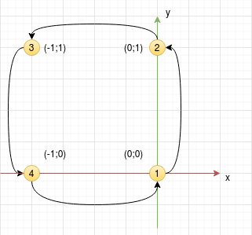

# Управление движением
Папка **motion** содержит файлы и ROS-пакеты для управления движением дрона

### Описание пакетов catkin внутри motion

[**teleop_twist_keyboard**]((https://github.com/ros-teleop/teleop_twist_keyboard) ) - пакет для управления роботами с клавиатуры, добавлен в проект как git-подмодуль.  

**autotakeoff** - пакет для автоматического взлета дрона в воздух. Поддерживает автопилоты ArduPilot и PX4.  

*cmd_vel_remapper_node.py* - скрипт, перенаправляющий данные из топика /cmd_vel в топик /mavros/setpoint_raw/local.  

*pos_cmd_remapper.py* - скрипт, перенаправляющий данные из топика /planning/pos_cmd в /mavros/setpoint_position/local.  

*square_flight_node.py* - скрипт полета по квадрату.  

*takeoff_node.py* - скрипт автоматического взлета и посадки дрона.  

*takeoff_server.py* - сервис взлета дрона.  

**flight_tests** - пакет для тестирования качества отработки различных полетных ситуаций:  
1. взлет-посадка (takeoff_test.launch)  
2. зависание в воздухе заданное время (position_hold_test.launch)  
3. полет по точкам (flight_through_points_test.launch)  
4. поворот на заданный угол (rotate_angle_test.launch)  
5. вращение на заданное число кругов (spin_laps_test.launch)

### Взлет и посадка 
```bash
roslaunch autotakeoff takeoff.launch ap_type:=0 altitude:=1.5 use_vision_odometry:=0 square_side:=0.5
```  
### Полет по квадрату  
```bash
roslaunch autotakeoff square_flight.launch ap_type:=0 altitude:=1.5 use_vision_odometry:=0
```  


  
Параметр ```square_side``` определяет размер стороны квадрата в метрах.  
### Управление с клавиатуры  
Для запуска управления дроном с клавиатуры (например, с контролллером px4), необходимо:
1) запустить автопилот дрона и симулятор gazebo
```bash
roslaunch launcher first_scene_world.launch
```
2) запустить пересылку сообщений из cmd_vel: 
```bash
roslaunch autotakeoff cmd_vel_remapper.launch ap_type:=0 altitude:=1.5 use_vision_odometry:=0 takeoff_on_msg:=1
```  
3) запустить пакет teleop_twist_keyboard
```bash
rosrun teleop_twist_keyboard teleop_twist_keyboard.py _repeat_rate:=10.0
```

### Поворот дрона на заданный угол  
Поворот дрона осуществляется из кода, вызовом соответствующих функций. Для поворота реализовано 2 функции в классе MavController:  
1. ```spin(ang_vel, altitude, stop_cond=lambda a, l: False, on_finish=lambda: None)``` - неблокирующий поворот.

```python  

def on_finish():
    rospy.loginfo("Drone rotated!")

drone = MavController.create_controller(Autopilot.PX4 use_vision_odometry=False)  
drone.takeoff(height=1.5)
# дрон начинает поворот на 90 градусов (1.57 рад) со скоростью 0.5 рад/с
drone.spin(ang_vel=0.5, altitude=1.5, stop_cond=lambda a, l: a >= 1.57, on_finish=on_finish)
# при выводе этого сообщения дрон все еще будет вращаться
rospy.loginfo("Drone is spinning")
# когда дрон повернется на нужный угол, будет вызвана функция on_finish()
```
2. ```rotate(altitude, ang_vel = 0.5, stop_cond=lambda a,l: False)``` - блокирующий поворот. 


```python  
drone = MavController.create_controller(Autopilot.PX4 use_vision_odometry=False)  
drone.takeoff(height=1.5)
# поворачиваем дрона с скоростью 3.14 рад/с на 90 градусов (1,57 рад) против часовой стрелки (ang_vel > 0)
drone.rotate(ang_vel= 3.14, altitude = 1.5, stop_cond = lambda a,l: a >= 1.57)  
# сообщение будет выведено только после того, как дрон повернется на заданный угол
rospy.loginfo("Drone rotated!")

```

Аргумент ```stop_cond``` является критерием останова поворота. Он представляет из себя лямбда-функцию с двумя аргументами: angle, laps, где angle - текущий угол, laps - текущее количество сделанных кругов. Если хотим повернуться на 180 градусов: ```stop_cond = lambda a,l: a >= 3.14```. Если хотим сделать 3 круга: ```stop_cond = lambda a,l: l == 3```.  

### Взлет и посадка через сервис

1. Запускаем сервис:  
```bash  
rosrun autotakeoff takeoff_server.py _ap_type:=0
```  

2. Осуществляем взлет:  
```bash  
rosservice call /takeoff_landing "height: 1.5
land: false" 
```  
3. Осуществляем посадку:  
```bash  
rosservice call /takeoff_landing "height: 1.5
land: true" 
```  
Для посадки достаточно указать land=True, значение высоты при этом игнорируется.  
